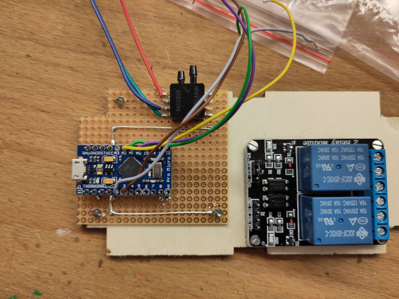
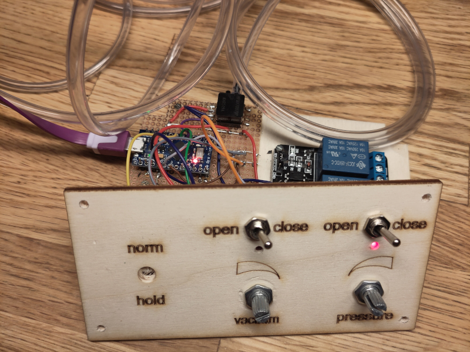
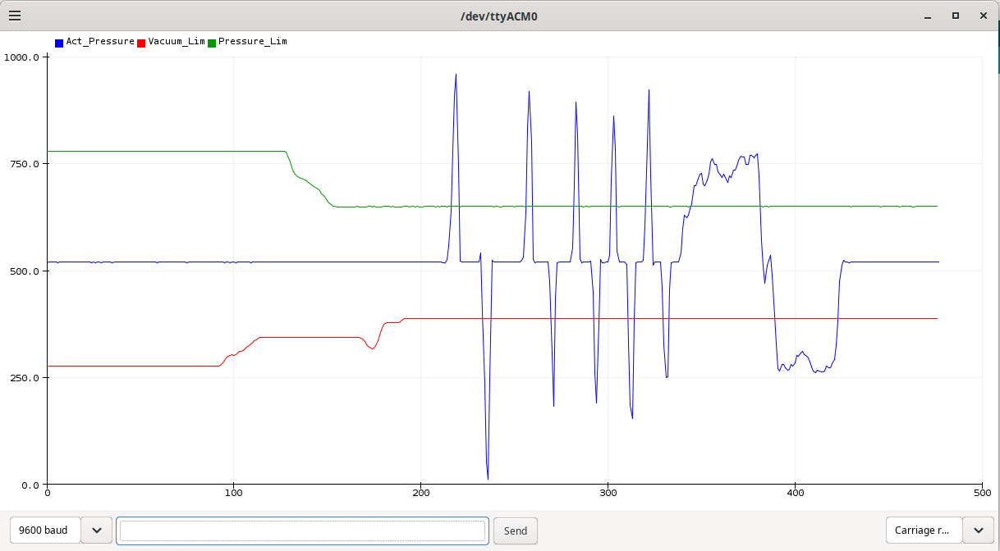

# Barometer Pedal

Replaces a Roland DP-2 Foot-Pedal for an E-Piano with an electronic switch, driven by air-pressure applied with the mouth.
Intended for handicapped people playing e-Piano but can not use a foot-switch, lile the Roland DP-2.

## Hardware

Main element is an Air-pressure sensor from NXP, the MPXV 7007 DP.   
This is an differential sensor, so it returns on default a voltage of 2.5 V,  
when applying under-pressure it returns an analog value between 0 and 2.5 V,   
when applying over-pressure it returns an anaolg value between 2.5 and 5 V.

Around 20 years ago the rest of the HW would have been a simple comparator like the LM741 ...
In the meantime micro-controllers are so cheap and I had some Arduino Micro like hardware lying around, 
so I decided to go with that and some simple Software.   
Once more a project "shooting with canons to sparrows", but in the end it gives more flexibility and potential extensibility...

* Link to the [Data-Sheet of the Sensor](https://www.nxp.com/docs/en/data-sheet/MPXV7007.pdf)  
* Link to some info about the Sparkfun [Arduino Pro Micro - Clone](https://learn.sparkfun.com/tutorials/pro-micro--fio-v3-hookup-guide/introduction) 
* Link to some info about the [Roland-Switches in German](https://www.musiker-board.de/threads/tipp-roland-fussschalter-original-und-preiswerte-alternativen.336893/)
* Some good general [info about pressure sensors](https://www.teachmemicro.com/arduino-pressure-sensor-tutorial/), not this specific one, still valuable.

### Simple version 

* Arduino Pro Micro
* Air-Pressure Sensor NXP : MPXV 7007 DP
* One 5V Arduino relay

### Flexible Version

* Arduino Pro Micro
* Air-Pressure Sensor NXP : MPXV 7007 DP
* Two 5V Arduino relay ( to allow reacting on over- and under-pressure)
* Two potentiometers ( to allow changing the needed pressure-level per channel )
* Two switches ( to allow opening - like the Roland DP-2 - closing a circuit )

## Software 

Simple Arduino-Sketch: 

* On switch-on reading the pressure-sensor several times to read the default-value.
* Then: Continuously reading the pressure sensor
* comparing it against the upper-switch-level and switching a relay 
* comparing it against the lower-switch-leval and switching another relay

## Some Pictures intermediate

**The prototype in the make**

**The prototype in action**

**Arduino Plotter**

This shows first the "adjustments" on the needed pressure/vacuum - levels with the potentiometers and then the "playing" with the pressure sensor in the middle, putting pressure or vacuum on the sensor.
Each time it crosses the upper or the lower barrier, the relevant relay will be switched.

